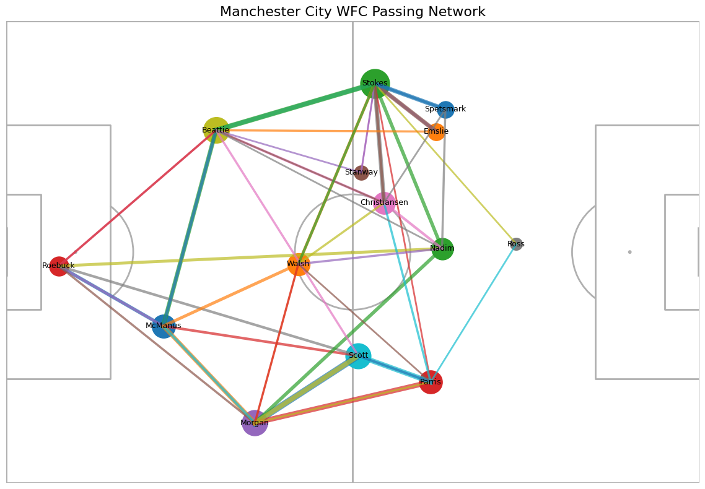

# WSL Football Analysis
*All data from StatsBomb* 

## 1. Manchester City WFC - Passing Network Analysis

### Objective 
Analyse passing structure and player connectivity to understand build-up play and key relationships.

### Method 
Event data was analysed using Python to extract passes, player positions, and passing relationships. A passing network was created using average player locations and pass frequencies.

### Key Insights
- Strong passing connections are evident down both the left and right wings, suggesting a clear focus on wide build-up play.
- Goalkeeper distribution is a key part of progression, with a particularly strong connection between Roebuck and Nadim indicating a direct outlet from the back.
- Walsh appears to be a central figure in possession, acting as a key distributor in midfield and linking different areas of the pitch.
- There are fewer passing connections in the attacking half compared to the defensive half, which may suggest more direct play or quicker transitions in advanced areas.

### Visuals

### Conclusion
Overall, the passing network suggests a structured build-up from the back, with the goalkeeper and central midfield playing important roles in progressing the ball. Wide areas are consistently utilised, with strong connections on both flanks. The reduced number of passes in the attacking half may indicate a more direct approach in the final third, focusing on quicker attacking actions rather than sustained possession.

---

## StatsBomb
### Competitions
- competition_name
- competition_gender
- season_name 

### Events 
References:
- 19714 to 19822 WSL games
- 22921 to 68321 Women's International games
